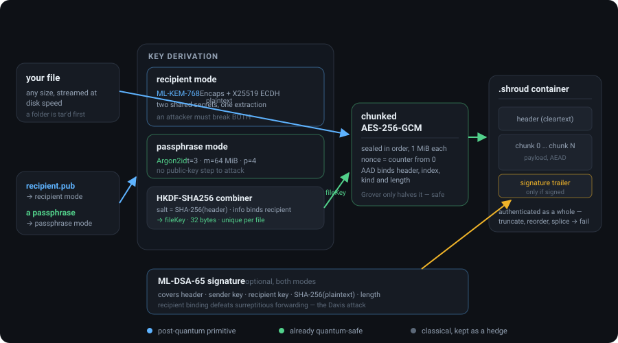
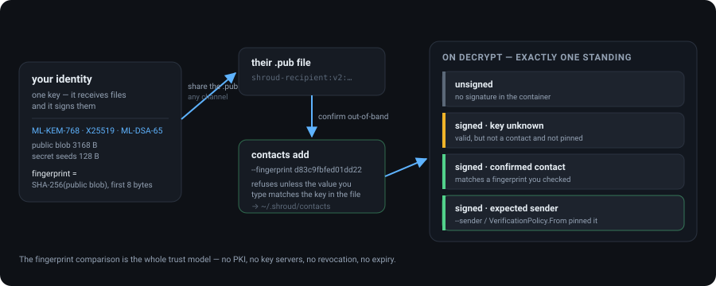

<div align="center">

# Shroud

**Post-quantum file encryption.**

Encrypt a file to someone who has only your public key, or to a passphrase. The key
transport and the signatures are post-quantum; the bulk cipher was already safe.
.NET 10, one dependency, streams files of any size at disk speed.

[](https://dotnet.microsoft.com)
[](src/Shroud.Core/Shroud.Core.csproj)
[](#what-is-actually-post-quantum-here)
[](#signing-and-verifying)
[](LICENSE)



</div>

> **This is a purpose-built format and it has not been audited.** The primitives are
> BouncyCastle's; the container around them is mine. For anything high-stakes, use something
> with eyes on it — `age`, GnuPG ≥ 2.5, LUKS2, Sigstore. See
> [Known limitations](#known-limitations) and [Alternatives worth preferring](#alternatives-worth-preferring)
> before relying on it for real secrets.

```
shroud keygen  --out alice
shroud encrypt --in report.pdf --out report.pdf.shroud --recipient bob.pub --sign alice.key
shroud decrypt --in report.pdf.shroud --out report.pdf --key bob.key --sender alice.pub
```

`USAGE.md` is the operator's guide: recipes, key handling, scripting, and the mistakes worth
avoiding. `FORMAT.md` is the wire format.

---

## What it is

A single-file encryption tool and a small .NET library. It puts one file — or one directory,
packed into a tar — into a `.shroud` container that only the intended recipient can open, and
optionally signs it so the recipient can tell it came from you and was meant for them.

Nothing leaves your machine. There is no service, no account, no network call at any point.
The only dependency is BouncyCastle, and only the post-quantum primitives go through it; the
bulk `AES-256-GCM` uses the hardware-accelerated .NET implementation.

## What is actually post-quantum here

AES-256-GCM is already quantum-resistant — Grover's algorithm only halves the effective key
length, leaving a ~128-bit security level. The primitives a quantum computer breaks are the
**key transport** and the **signature**: RSA and ECDH key wrapping, and RSA/ECDSA/Ed25519
signing, all fall to Shor's algorithm.

So the bulk cipher is unchanged and the public-key layers are what got replaced:

| Layer | Primitive | Quantum status |
|---|---|---|
| Payload | AES-256-GCM | Already safe |
| Key wrapping (recipient mode) | ML-KEM-768 **+** X25519 | ML-KEM is the PQ part |
| Sender signatures | ML-DSA-65 | The PQ replacement for Ed25519 |
| Key stretching (passphrase mode) | Argon2id | Already safe |
| Derivation | HKDF-SHA256 | Already safe |

The threat this addresses for encryption is **harvest-now-decrypt-later**: an adversary captures
ciphertext today and decrypts it once a quantum computer exists. That only matters if the data's
confidentiality lifetime is long. If your files stop mattering in eighteen months, you do not
need this.

Signatures have the opposite time profile. A signature is verified now, so a future quantum
computer cannot retroactively forge one you already checked — but it can forge new ones from the
day it exists, for as long as the key is in use. Post-quantum signing is about the lifetime of
the **key**, not of the file.

<details>
<summary><b>Why hybrid, not ML-KEM alone</b></summary>

ML-KEM was standardised in FIPS 203 in August 2024 and has far less deployment scar tissue than
X25519. Combining both means an attacker must break *both* to recover the file key, so adopting
the newer primitive cannot make you worse off than you were. The cost is 1088 bytes of header
and a rounding error of CPU time.

The signature is **not** hybrid. A hybrid signature would have to be verified as a unit to mean
anything, and it doubles the trailer for a threat model where a break is noticed rather than
silently exploited. ML-DSA-65 alone is the trade this format makes; if that is the wrong trade
for you, sign the container separately with something you trust.
</details>

<details>
<summary><b>Why passphrase mode needs no PQ primitive</b></summary>

It has no public-key step to attack. Argon2id plus AES-256 is quantum-safe as it stands. If your
use case is "encrypt these files at rest with a passphrase", that mode is the whole answer and
the ML-KEM machinery is not doing anything for you. Signing still works in that mode, and is the
only part of it that involves a key pair.
</details>

---

## Install

**Requires:** the .NET 10 SDK. No installer, no service, no network access at any point.

```
dotnet publish src/Shroud.Cli -c Release -o dist       # the shroud CLI
dotnet publish src/Shroud.Ui  -c Release -o dist-ui    # the desktop UI (optional)
```

That produces `dist/shroud` (`dist/shroud.exe` on Windows) alongside its DLLs — put the
directory on your `PATH`, or invoke it by path.

## Two modes

**Recipient mode** — the sender needs only the recipient's public key, and cannot decrypt what
they sent. Use for sending files to someone.

**Passphrase mode** — no keys to manage. Use for encrypting your own files at rest.

```
# recipient mode
shroud keygen --out alice                    # alice.key (private), alice.pub (shareable)
shroud encrypt --in q3.xlsx --out q3.shroud --recipient bob.pub
shroud decrypt --in q3.shroud --out q3.xlsx --key bob.key

# passphrase mode (prompts; or use --passphrase-file / SHROUD_PASSPHRASE)
shroud encrypt --in q3.xlsx --out q3.shroud --passphrase
shroud decrypt --in q3.shroud --out q3.xlsx --passphrase

# inspect a container without any key
shroud info --in q3.shroud

# check a container is intact and from who you think, without writing the plaintext
shroud verify --in q3.shroud --key bob.key --sender alice.pub
```

Directories work too: pass one to `--in` and shroud packs it into a tar, records that fact in the
authenticated header, and unpacks it on the way out.

### Worked examples

<details>
<summary><b>Send a file to someone</b></summary>

```
alice  $ shroud keygen                     # once; writes ~/.shroud/identity.{key,pub}
bob    $ shroud keygen
       … alice and bob exchange .pub files by any channel …
       … each confirms the other's fingerprint by a call, then records it …

alice  $ shroud contacts add --in bob.pub --name bob --fingerprint d83c9fbfed01dd22
alice  $ shroud encrypt --in q3.xlsx --out q3.shroud --recipient bob
         signed by identity 4f1c… · wrote q3.shroud (2.1 MiB)

bob    $ shroud decrypt --in q3.shroud --out q3.xlsx --sender alice
         signature: alice (confirmed contact) ✓
```
</details>

<details>
<summary><b>Encrypt your own files at rest</b></summary>

```
$ shroud encrypt --in tax-2024/ --out tax-2024.shroud --passphrase
  passphrase: ········
  packed 38 files into a tar · wrote tax-2024.shroud

$ shroud decrypt --in tax-2024.shroud --out ./restored --passphrase
  passphrase: ········
  unpacked 38 files into ./restored
```
No key pair involved — Argon2id plus AES-256 is the whole thing.
</details>

<details>
<summary><b>Check a container without decrypting it</b></summary>

```
$ shroud info --in q3.shroud
  mode        recipient
  suite       ML-KEM-768 + X25519 + ML-DSA-65 / HKDF-SHA256 / AES-256-GCM
  signed      yes (identity is inside the encrypted region)
  archive     no
  chunk size  1 MiB

$ shroud verify --in q3.shroud --key bob.key --sender alice.pub
  intact ✓  ·  signed by alice.pub ✓
$ echo $?
  0            # 2 = malformed container, 3 = verification failed
```
</details>

---

## Signing and verifying

Signing is optional and works in both modes. `--sign` takes your **secret** key, because signing
is something only you can do; `--sender` takes the other party's **public** key, because
verifying is something anyone with that key can do.

```
shroud encrypt --in q3.xlsx --out q3.shroud --recipient bob.pub --sign alice.key
shroud decrypt --in q3.shroud --out q3.xlsx --key bob.key --sender alice.pub
```

**A signature only tells you who sent a file if you say who you expect.** Anyone can generate an
identity and sign with it, so a valid signature by itself proves only that the container is
self-consistent. Decrypting without `--sender` prints the signing fingerprint and a warning that
the identity was not checked; it is not a green tick. `--require-signed` rejects unsigned
containers without pinning an identity, which is the weaker of the two guarantees.

Verification failures exit with status 3, distinct from a malformed container (2), so a script
can tell "this was tampered with" from "this is not from who I expected".

What the signature covers is spelled out in `FORMAT.md`: the container header, the sender's key,
the **recipient's** key, and the plaintext's hash and length. Binding the recipient is what stops
Bob re-encrypting to Carol a message Alice only ever sent to Bob — the Davis attack on naive
sign-then-encrypt.

The sending identity travels *inside* the encrypted region, so `shroud info` on a signed container
will tell you that it is signed but not by whom. Only someone who can decrypt it learns that.

## Keys

One identity does both jobs: it receives files and it signs them. Keys are short text files.

```
# Shroud public key, fingerprint d83c9fbfed01dd22. Safe to share.
shroud-recipient:v2:iCkV0M2GS1ml...
```

Secret key files are **passphrase-protected by default** — Argon2id at t=4, m=128 MiB, p=4,
sealed with AES-256-GCM, with the cost parameters authenticated so they cannot be downgraded by
editing the file. `--plaintext-key` opts out and warns when it does. `shroud passwd` changes the
passphrase, or adds/removes protection, writing beside the original and swapping so an
interrupted run cannot lose your only copy.

```
shroud passwd      --key alice.key            # change or add the key passphrase
shroud fingerprint --in alice.pub             # print the fingerprint of a public or secret key
```

Share the fingerprint over a channel separate from the `.pub` file. That comparison is the whole
trust model — see the limitations below. Once you have done it, record it:

```
shroud keygen                                  # sets up ~/.shroud and signs by default from then on
shroud contacts add --in bob.pub --name bob --fingerprint d83c9fbfed01dd22
shroud encrypt --in q3.xlsx --out q3.shroud --recipient bob
```

`contacts add` refuses unless the fingerprint you type matches the key in the file, so the check
happens once, deliberately, instead of being retyped or skipped on every file. Afterwards shroud
names a known signer for you on decrypt, and reports an unknown one as unknown.

<div align="center">

</div>

## Desktop UI

There is an Avalonia desktop front end alongside the CLI — `run-ui.cmd`, or
`dotnet run --project src/Shroud.Ui`. Three screens: **Identity** (create or open yours),
**Contacts** (add a public key, confirming its fingerprint), and **Files** (drop a file or
folder in; it detects whether it is a container and offers encrypt or decrypt accordingly).

It exists for one reason: on the CLI, the security-critical result — whether the signature
came from someone you actually confirmed — is a line on stderr that scrolls past. In the UI
it is a banner you cannot miss.

Both front ends decide what a signature means with the same function, `SignatureReport.For`
in `Shroud.App`, which returns one of exactly four standings: unsigned, signed by an unknown
key, signed by a confirmed contact, or signed by the sender you named in advance. Neither
front end classifies signatures on its own, and `FrontEndParityTests` fails the build if one
of them grows a fifth case the other doesn't have.

## Library use

```csharp
using Shroud.Core;

var alice = ShroudSecretKey.Generate();           // the sender
var bob = ShroudSecretKey.Generate();             // the recipient

using (var input = File.OpenRead("report.pdf"))
using (var output = File.Create("report.shroud"))
    ShroudFile.Encrypt(input, output, bob.GetPublicKey(), sender: alice);

using (var input = File.OpenRead("report.shroud"))
using (var output = File.Create("report.pdf"))
{
    var result = ShroudFile.Decrypt(
        input, output, bob, VerificationPolicy.From(alice.GetPublicKey()));

    Console.WriteLine(result.SenderFingerprint);   // throws above if it does not match
}
```

Omit `sender` to produce an unsigned container. `VerificationPolicy.Optional` (the default)
verifies a signature if present and accepts an unsigned container; `VerificationPolicy.Required`
rejects unsigned ones; `VerificationPolicy.From(key)` additionally pins the identity.
`DecryptionResult.SenderWasExpected` is true only in that last case — a signed container under
the default policy reports `WasSigned` but not `SenderWasExpected`, because nobody said what to
expect.

`ShroudFile` is the entire public surface: `Encrypt`, `Decrypt`, `EncryptWithPassphrase`,
`DecryptWithPassphrase`, `ReadHeader`.

---

## How it works

The container is a cleartext header followed by a run of AES-256-GCM chunks, and every design
choice in it is defensive. `FORMAT.md` is the full spec; the load-bearing decisions:

- **`headerHash` keys every chunk.** The 9-byte prologue and the mode block are hashed, and that
  hash is both the HKDF salt and part of every chunk's associated data. Editing any header
  field — chunk size, suite, flags, the KEM ciphertext — changes the key and every tag fails.
- **The nonce is a bare counter from zero, and that is safe** only because `fileKey` is never
  reused: recipient mode draws a fresh ML-KEM encapsulation and ephemeral X25519 key per file,
  passphrase mode a fresh salt. A `(key, nonce)` pair cannot recur.
- **Chunks are self-describing and ordered.** `kind ‖ length ‖ ciphertext ‖ tag`, with `kind`
  and `index` in the AAD, so truncation (no chunk still claims to be final), reordering,
  duplication, and splicing from another container all fail loudly.
- **The signature binds the recipient.** It covers the header hash, the sender's own key, the
  recipient's key, and `SHA-256(plaintext) ‖ length` — so it cannot be lifted onto another file
  or forwarded to a third party as though it were sent to them.
- **Everything from an untrusted file is range-checked before allocation.** The flags byte is
  rejected outright if any unknown bit is set; Argon2 costs are validated against fixed ranges
  before a single byte is allocated.

## Integrity guarantees

The container is authenticated as a whole, not just chunk by chunk. Truncating it, reordering its
chunks, splicing chunks in from another container, editing any header field, editing the chunk
framing, or stripping the signature all fail loudly. `FORMAT.md` has the mechanism;
`TamperTests.cs` and `SignatureTests.cs` have a test for each case.

Those tests were mutation-checked — deleting the relevant line of the implementation makes the
corresponding test fail — because a tamper test that passes for the wrong reason is worse than
no test. That process caught a real hole in the first draft of the reordering test.

## Known limitations

Read these before relying on it.

1. **Not audited.** This is a purpose-built format, not a reviewed standard. For anything
   high-stakes, prefer something with eyes on it (see *Alternatives*).
2. **No trust model.** A signature proves a container was made by a particular *key*. Deciding
   that the key belongs to a particular *person* is entirely on you: compare fingerprints over a
   channel the file did not travel on. There is no PKI, no web of trust, no key servers, no
   revocation, and no expiry.
3. **Signature verification is not streaming-safe for library callers.** Every chunk is
   authenticated before its plaintext is written, so no forged bytes are ever released — but the
   signature covers the whole plaintext and can only be checked after the last chunk. A library
   caller reading from the output stream will therefore see verified-but-unattributed bytes
   before verification finishes. The CLI sidesteps this by staging to a temporary file and moving
   it into place only on success; on failure it deletes the staged file, which is an unlink, not
   a secure erase.
4. **No length hiding.** Plaintext size is visible to within one chunk, and the signature commits
   to the exact length. No padding.
5. **One recipient per container.** No multi-recipient, no key rotation.
6. **The unwrapped secret key lives in ordinary managed memory.** Key files are encrypted at rest,
   but once opened the key is a byte array the GC may copy and the OS may page out. No secure
   memory, no smartcard or HSM support.
7. **BouncyCastle, not native.** .NET 10 ships `System.Security.Cryptography.MLKem` and `MLDsa`,
   but `IsSupported` is `False` on stock Windows 11 — they need a CNG provider with PQC support,
   or OpenSSL 3.5+ on Linux. BouncyCastle's managed implementation works everywhere, which is why
   it is the dependency. Only the KEM, X25519, ML-DSA and Argon2id go through it; the bulk
   AES-256-GCM uses the hardware-accelerated .NET implementation.
8. **Archive extraction trusts the destination directory.** A tar from a counterparty is treated
   as hostile: entry names are normalised, links are resolved as the tree is descended, and every
   entry type except plain files and directories is refused. But checking a path and writing to it
   are separate steps, so someone who can write into your destination *while extraction is
   running* can still swap a directory for a link in between. Unpack into a directory only you can
   write to.

## Alternatives worth preferring

If any of these covers your case, use it instead — they have more review than this does.

- **Passphrase-only encryption at rest**: `age -p`, LUKS2, VeraCrypt, restic/borg. All already
  quantum-safe, no PQ machinery needed.
- **Both ends on GnuPG ≥ 2.5**: ML-KEM composite keys, real key management, smartcards, and an
  actual trust model. Note LibrePGP and IETF OpenPGP have diverged on PQC, so interop outside
  GnuPG is poor.
- **Signing without encrypting**: `signify`, `minisign`, or Sigstore. Classical signatures, but
  mature tooling and, in Sigstore's case, transparency logs.
- **Scriptable, OpenSSL 3.5+ available**: native `ML-KEM-768` via
  `openssl pkeyutl -encap`. Caveat: `openssl enc` cannot handle AEAD tags, so don't build the
  data layer with it.

## Performance

256 MiB on a laptop, default 1 MiB chunks, measured end to end including process start:

| Operation | Time | Throughput |
|---|---|---|
| Encrypt (recipient) | 0.62 s | ~430 MB/s |
| Encrypt (recipient, signed) | 0.64 s | ~420 MB/s |
| Decrypt (recipient) | 0.67 s | ~400 MB/s |
| Decrypt (signed, verified) | 0.67 s | ~400 MB/s |

Signing costs about 20 ms on a file that size — the ML-DSA operation is constant, and the
plaintext hash rides along on the pass that is already encrypting. Memory is one chunk regardless
of file size.

The Argon2id costs dominate everywhere they appear, by design:

| | Added cost |
|---|---|
| Passphrase mode, per file (t=3, m=64 MiB, p=4) | ~0.7 s |
| Opening a protected key file (t=4, m=128 MiB, p=4) | ~1.2 s |
| `keygen` writing a protected key | ~1.2 s |

Container overhead on that 256 MiB file is 6526 bytes, or 13024 signed.

---

## Development

```
dotnet build
dotnet test                                        # 226 tests, no network, no platform crypto provider
dotnet publish src/Shroud.Cli -c Release -o dist   # the shroud CLI
dotnet publish src/Shroud.Ui  -c Release -o dist-ui # the desktop UI
```

Requires the .NET 10 SDK. The 226 tests split 101 format, 34 workspace, 85 CLI, 6 UI.

Four projects: the format library, a workspace layer both front ends share, and the two
front ends themselves.

```
src/Shroud.Core/            the container format — no I/O policy, no user concepts
  ShroudFile.cs             public API, verification policy
  ShroudFormat.cs           wire constants
  FileHeader.cs             header serialisation and strict parsing
  HybridKem.cs              ML-KEM-768 + X25519 encapsulation
  ContainerSignature.cs     ML-DSA-65 signing, and what the signature binds
  KeyDerivation.cs          the HKDF combiner and the Argon2id path
  ChunkedAead.cs            streaming AES-256-GCM with ordering/framing binding
  ShroudKeys.cs             key generation, armour, encrypted key files, fingerprints
  Argon2.cs                 the BouncyCastle Argon2id call
  Argon2Settings.cs         cost parameters and their range checks

src/Shroud.App/             shared by both front ends, so they cannot drift apart
  ShroudEngine.cs           encrypt/decrypt/inspect orchestration behind IShroudEngine
  ShroudWorkspace.cs        an instance-based view of one identity + contacts store
  ShroudHome.cs             where the identity and contacts live (~/.shroud, SHROUD_HOME)
  ContactStore.cs           public keys you have checked, kept in ~/.shroud/contacts
  IdentityService.cs        identity creation, and KeyFiles.cs the armoured files
  Archive.cs                directory packing, and a tar extractor that refuses to escape
  FileOperations.cs         staging: write beside the target, move into place on success
  SignatureStanding.cs      the four signature outcomes, and BannerMapping.cs their wording
  ProgressStream.cs         byte-count reporting for the UI's progress bar

src/Shroud.Cli/
  Program.cs                the shroud command

src/Shroud.Ui/              Avalonia desktop front end
  Views/                    Identity, Contacts and Files screens
  ViewModels/               screen state; FilesViewModel.cs drives encrypt/decrypt
  Styles/Components.axaml   the component set

tests/Shroud.Core.Tests/    round-trip, tamper, signature and key-handling tests
tests/Shroud.App.Tests/     workspace, contacts, identity, staging, progress
tests/Shroud.Cli.Tests/     command behaviour: exit codes, option validation, staging,
                            contacts, directories, archive-extraction safety
tests/Shroud.Ui.Tests/      view-model behaviour for the Files screen
```

`USAGE.md` is the operator's guide · `FORMAT.md` is the wire format · `SECURITY.md` is the threat
model and disclosure path.

---

<div align="center">
<sub>A shroud is standing rigging — the fixed lines that hold the mast up from either side. It is not glamorous and it is not meant to move; it is meant to hold.</sub>
</div>
